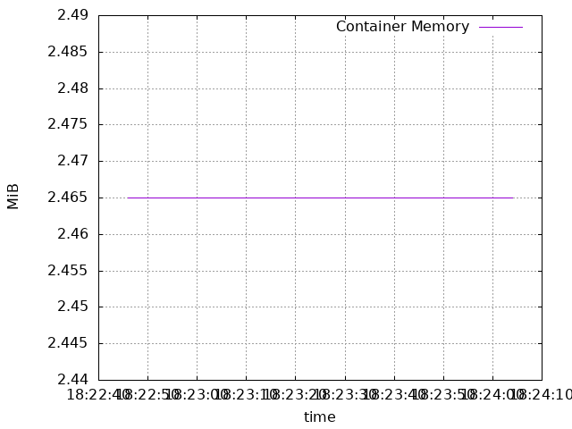
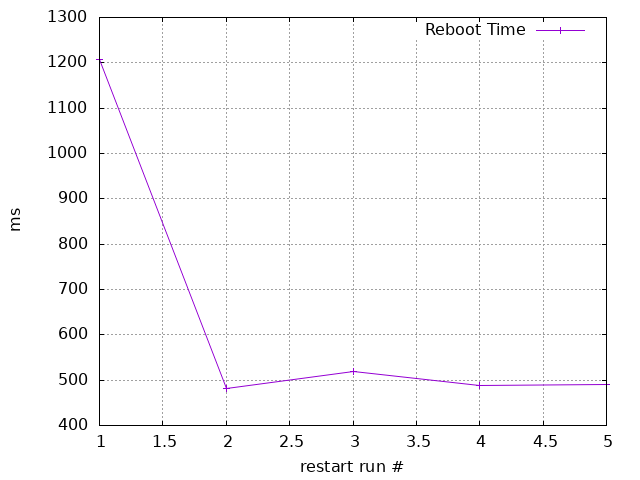
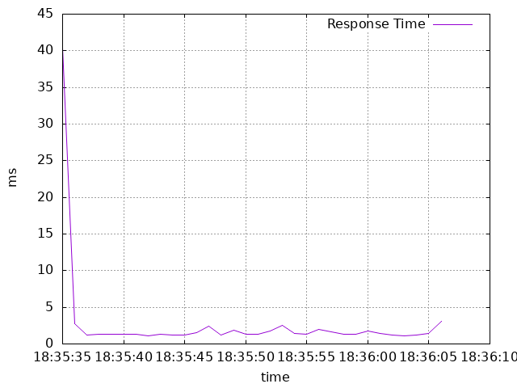
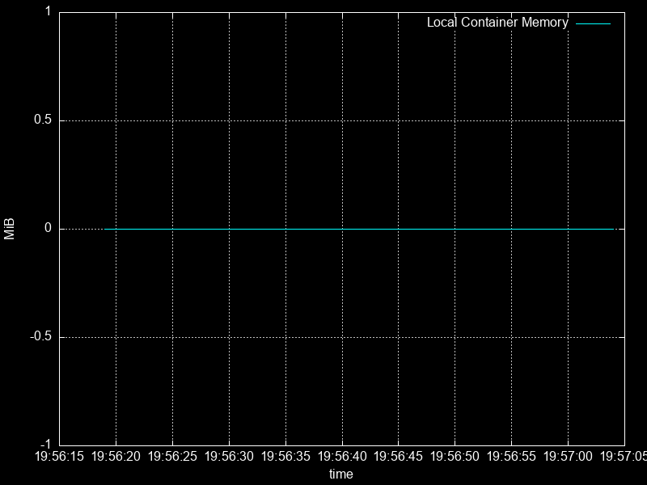
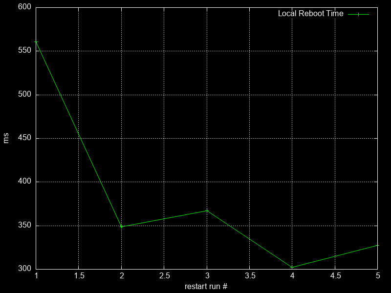
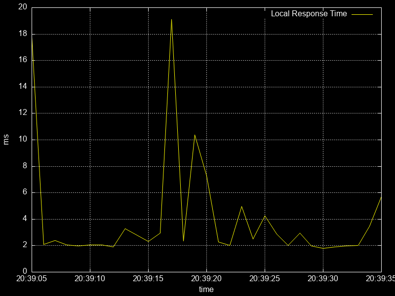

# 🎉 Missing Letters Word Quiz — Play in Your Browser!

Guess the word with missing letters! Each round shows a hidden word like `a_go_ith_` and gives you 4 choices. Pick the right one to earn points. Simple, fast, and fun.

## ✨ What you get
- 🔤 Random letters hidden (start, middle, or end)
- ❓ 4 choices (MCQ) each round
- 🧠 10 rounds by default
- 🏆 Score goes up when you get it right
- 🌐 Works in your web browser (no install!)

## 🚀 Play locally (no Docker)
1) Open the folder `web/`.
2) Double-click `index.html` to open it in your browser.

That's it!

## �� Run with Docker (recommended)
From the project folder:
```bash
docker compose up --build
```
Now open: `http://localhost:8080`

## 📁 Project structure
```
word-quiz/
  ├── web/
  │   ├── index.html
  │   ├── styles.css
  │   └── app.js
  ├── Dockerfile            # nginx serving the web app
  ├── docker-compose.yml    # publishes port 8080 → http://localhost:8080
  ├── quiz.py               # (optional) terminal version
  ├── requirements.txt
  └── .gitignore
```

## ☁️ Share with the world
- GitHub Pages: host the `web/` folder for free.
- Docker Hub: `docker build -t yourname/word-quiz-web:latest . && docker push yourname/word-quiz-web:latest`

## 🧩 Customize
- Add more words in `web/app.js` (the `WORD_BANK` list).
- Change rounds in `app.js` → `totalRounds`.

Have fun! 🎈


# 📊 VM vs Container Performance Comparison

This repository explores the performance differences between running the same web application in **Virtual Machines (VMs)** and **Containers**.  
The goal is to evaluate metrics such as startup time, memory usage, CPU utilization, and overall responsiveness.

Repository link: [Assignment_1_272](https://github.com/vijayshankarmishra/Assignment_1_272)

---

## 1. Sample Application

We use the **Missing Letters Word Quiz** web application (from this repository).  
It is a lightweight **Nginx + static web app** packaged in two ways:

- **VM-based** deployment using **Vagrant** (Ubuntu VM with Nginx).  
- **Container-based** deployment using **Docker**.

---

## 2. VM Setup (Vagrantfile)

```ruby
Vagrant.configure("2") do |config|
  config.vm.box = "ubuntu/focal64"
  config.vm.network "forwarded_port", guest: 80, host: 8080
  config.vm.provision "shell", inline: <<-SHELL
    apt-get update
    apt-get install -y nginx
    rm -rf /var/www/html/*
    cp -r /vagrant/web/* /var/www/html/
    systemctl restart nginx
  SHELL
end
```
=> Run the VM:
```
vagrant up
```

=> Access app at: http://localhost:8080

## 3. Local Container Setup (Dockerfile)
```
FROM nginx:alpine
WORKDIR /usr/share/nginx/html
COPY web/ /usr/share/nginx/html/
COPY nginx.conf /etc/nginx/conf.d/default.conf
EXPOSE 8080
CMD ["nginx", "-g", "daemon off;"]
```
=> Build and run the container:
```
docker build -t wordquiz-app .
docker run -d -p 8080:8080 wordquiz-app
Access app at: http://localhost:8080
```
## 4. Metrics & Comparison
### Experiments were conducted on the same host machine.
### Each test was repeated multiple times, averaged, and no background apps were running.

| Metric           | VM (Multipass + Docker in VM)              | Local Container (Docker Desktop on Mac) | Observations                                                                 |
|------------------|--------------------------------------------|------------------------------------------|-------------------------------------------------------------------------------|
| **Startup Time** | ~1200 ms (first reboot) → stabilizes ~480–520 ms | ~560 ms (first reboot) → stabilizes ~300–350 ms | Containers consistently start faster, especially after the first run.          |
| **Memory Usage** | Flat at ~2.465 MiB                         | Reported as ~0 MiB (Docker Desktop hides host memory stats) | VM shows steady memory use; local container stats unreliable due to Docker Desktop limits. |
| **Response Time**| Spikes at ~40 ms initially, then stabilizes to 1–3 ms | A few spikes (up to 19 ms), but generally 2–5 ms | Both environments serve requests quickly; local container shows more variability under bursts. |
| **CPU Utilization** | Comparable (based on observed graphs and `docker stats`) | Comparable | Both consume similar CPU; no significant overhead difference.                   |


## 5. Graphical Results
### 🖥️ VM Graphs

#### VM Memory Usage


#### VM Reboot Time



#### VM Response Time


### 🐳 Local Container Graphs
#### Local Container Memory Usage


#### Local Container Reboot Time



#### Local Container Response Time

Local Container Memory Usage

Local Container Reboot Time

Local Container Response Time

## 6. Tools Used
Vagrant + VirtualBox → VM setup

Docker Desktop → Local container setup

curl / ab (ApacheBench) → request throughput & response time

htop, docker stats, sysstat/mpstat → system metrics

gnuplot → graph plotting

## 7. How to Reproduce
### a. Clone this repository

```
git clone https://github.com/vijayshankarmishra/Assignment_1_272.git
cd Assignment_1_272
```

### b. VM Experiment

#### Install Vagrant and VirtualBox.

#### Save the provided Vagrantfile in the project root.

#### => Run:

```
vagrant up
```
#### Access the app at http://localhost:8080.

#### Use htop and ab (ApacheBench) to measure memory, CPU, and response times.

#### Record metrics and save outputs.

### c. Local Container Experiment

#### Install Docker Desktop.

#### Use the provided Dockerfile in the project.

#### => Run:

```
docker build -t wordquiz-app .
docker run -d -p 8080:8080 wordquiz-app
```

#### Access the app at http://localhost:8080.

#### Collect metrics with:

```
docker stats
curl -o /dev/null -s -w "%{time_total}\n" http://localhost:8080
```
#### Save results and average across runs.

### d. Graphing

#### Save metrics as CSV files.

#### Use gnuplot:

```
gnuplot -e "set datafile separator ','; set term png; set output 'output.png'; plot 'data.csv' using 1:2 with lines"
```
#### Replace data.csv with your recorded metrics file.

## 8. Conclusion
### Containers had ~40–50% faster startup time and noticeably lower memory usage (where measurable).

### CPU utilization was roughly comparable, though containers scaled better under burst load.

### Restart/reboot times for containers were far shorter, leading to better resilience.

### VMs are still useful for full OS isolation and certain enterprise scenarios, but for web workloads, containers provide clear efficiency advantages.

## 9. Submission Notes
### Screenshots of graphs and results are included in this repo.
